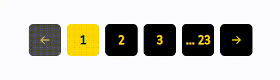

## <p align="center">Hi 👋 I'm an expert on React Js 👨‍💻 Next JS and FrontEnd Web Developer.</p>
<br/><br/>


## Description Library
> Before you start the description if you want to install this package visit this [Link](https://www.npmjs.com/package/react-pagination-master) the site npmjs
>
> Library ■ A very useful and efficient pagination library for React-Spa websites that shows data without refreshing the page
>
> It is very compact and optimized and has only `2 dependencies`, both react and react-dom.
>
> *__Without refreshing the page, the products shown and the URL changes__*
>
> The way the package works is that first you enter all the data you need and the number of data you want on each page and leave the rest of the work to the package ☻
>
> High personalization capabilities such as color, background, visibility or lack of auxiliary arrows, etc.
>
> One of the most interesting and useful features of this library is that if you have 3 pages for your products، you have 3 boxes for pagination. Let's say your site's route to display products is all-Datas/page/1 If the user manually tries to change 1 to 0 or less or greater than 3, it will automatically be redirected to page 1. 
>
> In addition، if you have 1 product page، you won't be shown pagination in the DOM of your project، but the URL logic is if it is all-courses/page/1، although pagination is not shown، but if the user wants to move the number 1 higher or lower، the library itself will redirect the user to page 1، and that's the authority of this library.
>

**_NOTE_**
📝 
This library is for React language only.
## View of the Library




## Usage
- Import the pagination component first.
```javascript
import Pagination from 'react-pagination-master'
```
- Then enter these essential items to launch pagination
```javascript
<Pagination
    arrDatas={allDatas}
    countDataPerPage={3}
    pathName={'/all-courses/page/'}
    onFilterDatas={handleFilterArrDatas}
/>
```
- format your datas. Of course، using useState is optional you only need to format the information you send must be the object in the array format.
```javascript
const [allDatas, setAllDatas] = useState([
    {id:1, ...},
    {id:2, ...},
    {id:3, ...},
    {id:4, ...},
])
```
# Example
```javascript
import React, { useState, useEffect } from 'react'
import Pagination from 'react-pagination-master'

export default function Test() {

    const [allDatas, setAllDatas] = useState([])
    const [filterDataPage, setFilterDataPage] = useState([])

    useEffect(() => {
        fetch(`http://localhost:3000/v1/datas`)
            .then(res => res.json())
            .then(datas => setAllDatas(datas))
    }, [])

    const handleFilterArrDatas = datas => setFilterDataPage(datas)

    return (
        <section>
            <div>
                {
                    filterDataPage.map((datas, index) => (
                        <Course key={index} {...datas} />
                    ))
                }
            </div>

            <div>
                { allDatas.length &&
                    <Pagination
                        arrDatas={allDatas}
                        countDataPerPage={3}
                        pathName={'/all-Datas/page/'}
                        onFilterDatas={handleFilterArrDatas}
                    />
                }
            </div>
        </section>
    )
}
```

## Uses Props The Pagination 

| Parameter | Type     | Description                |
| :-------- | :------- | :------------------------- |
| `arrDatas` | `Array` | **_Required_**. Array of products or anything else |
| `countDataPerPage` | `Number` | **_Required_**. On each page you want to show multiple items |
| `pathName` | `String` | **_Required_**. The URL that your product is located in. |
| `onFilterDatas` | `Function` | **_Required_**. Returns a function that contains data on that page، such as page 4. |
| `isArrowsShow` | `Boolean` | **_Optional_**. Auxiliary arrows for switching between pages |
| `separateBox` | `Boolean` | **_Optional_**.  I mean, with... Spaces between page 1 and 4 |
| `directionPage` | `String` | **_Optional_**.  direction pagination rtl or ltr. by default ltr |
| `bgColor` | `String` | **_Optional_**. Background-Color of all boxes. |
| `bgColorActive` | `String` | **_Optional_**. The background color of the box of that active page |
| `color` | `String` | **_Optional_**. Color of all boxes. |
| `colorActive` | `String` | **_Optional_**. Text Color Box of the active page |


___
>### Social Network
> [](https://github.com/khadem-mh)
> [](https://www.linkedin.com/in/khadem-mh/)
> [](https://t.me/mhkhadem)
> [](https://wa.me/989031335939)
> [](https://wakatime.com/@khadem_mh)
