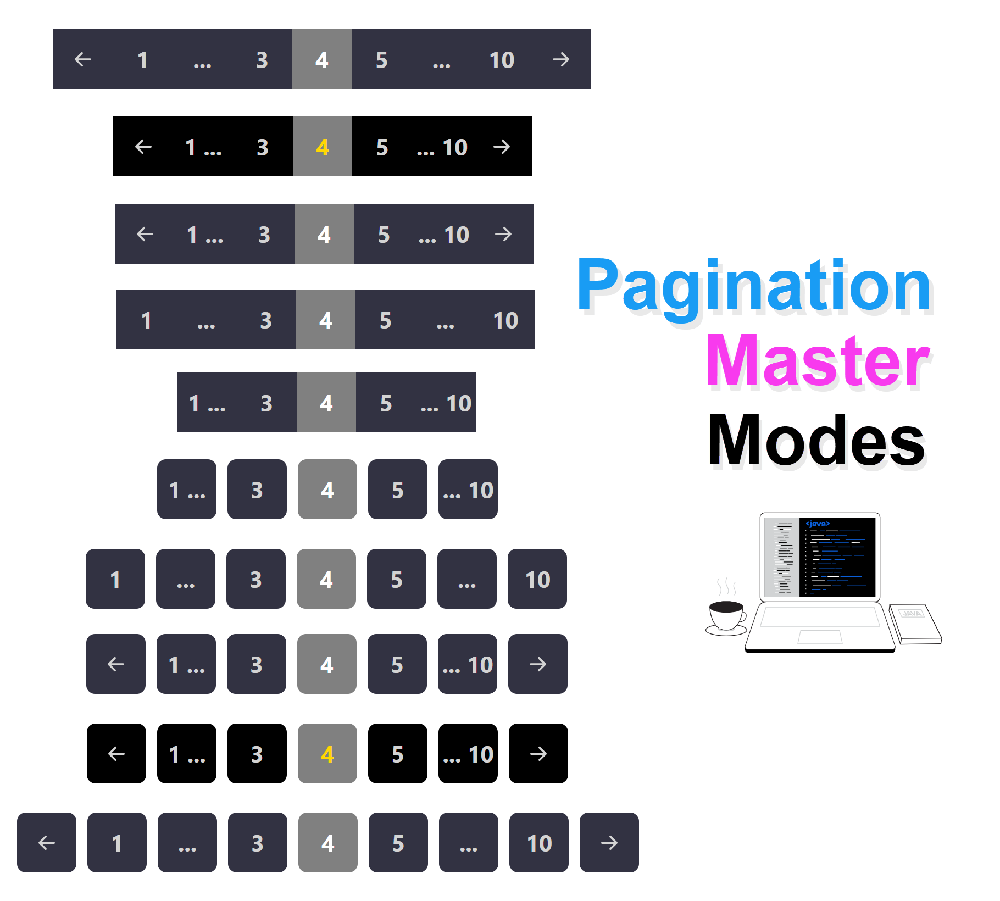

# <p align="center"> Hi there 👋 I'm Mohammad Hossein 👨‍💻 </p>
<p align="center"> React Js expert and FrontEnd Developer from Iran.</p>

## Description Library
> Before you start the description if you want to install this package from the npmjs website, visit this [Link](https://www.npmjs.com/package/react-pagination-smooth)
>
> Of course, you can add the same Pagination folder in your project and use only one line of import and use
>
> Library ■ A very useful and efficient pagination library for React-Spa websites that shows data without refreshing the page
>
> It is very compact and optimized and has only `2 dependencies`, both react and react-dom.
>
> The way the package works is that first you enter all the data you need and the number of data you want on each page and leave the rest of the work to the package ☻
>
> High personalization capabilities such as color, background, visibility or lack of auxiliary arrows, etc.

## View of the Library




## Usage
- Import the pagination component first.

```javascript
import Pagination from 'Pagination';
```
- Then enter these essential items to launch pagination
```javascript
 <Pagination
    arrDatas={arrDatas}
    countDataPerPage={1}
    pathName={'/all-courses/page/'}
    onFilterDatas={handleFilterArrDatas}
/>
```
- An example in the project.
```javascript
import React, { useState, useEffect } from 'react'
import Pagination from 'Pagination';

export default function Test() {

    const [allDatas, setAllDatas] = useState([])
    const [filterDataPage, setFilterDataPage] = useState([])

    useEffect(() => {
        fetch(`http://localhost:3000/v1/datas`)
            .then(res => res.json())
            .then(datas => setAllCourses(datas))
    }, [])

    const handleFilterCourses = datas => setFilterCoursesPage(datas)

    return (
        <section>
            <div>
                {
                    filterDataPage.map((datas, index) => (
                        <Course key={index} {...datas} />
                    ))
                }
            </div>

            <div>
                <Pagination
                    arrDatas={arrDatas}
                    countDataPerPage={6}
                    pathName={'/all-Datas/page/'}
                    onFilterDatas={handleFilterArrDatas}
                />
            </div>
        </section>
    )
}
```

## Uses Props The Pagination 

| Parameter | Type     | Description                |
| :-------- | :------- | :------------------------- |
| `arrDatas` | `Array` | **_Required_**. Array of products or anything else |
| `countDataPerPage` | `Number` | **_Required_**. On each page you want to show multiple items |
| `pathName` | `String` | **_Required_**. The URL that your product is located in. |
| `onFilterDatas` | `Function` | **_Required_**. Returns a function that contains data on that page، such as page 4. |
| `isArrowsShow` | `Boolean` | **_Optional_**. Auxiliary arrows for switching between pages |
| `separateBox` | `Boolean` | **_Optional_**.  I mean, with... Spaces between page 1 and 4 |
| `directionPage` | `String` | **_Optional_**.  direction pagination rtl or ltr. by default ltr |
| `bgColor` | `String` | **_Optional_**. Background-Color of all boxes. |
| `bgColorActive` | `String` | **_Optional_**. The background color of the box of that active page |
| `color` | `String` | **_Optional_**. Color of all boxes. |
| `colorActive` | `String` | **_Optional_**. Text Color Box of the active page |


___
>### Social Network
> [](https://github.com/khadem-mh)
> [](https://www.linkedin.com/in/khadem-mh/)
> [](https://t.me/mhkhadem)
> [](https://wa.me/989031335939)
> [](https://wakatime.com/@khadem_mh)
